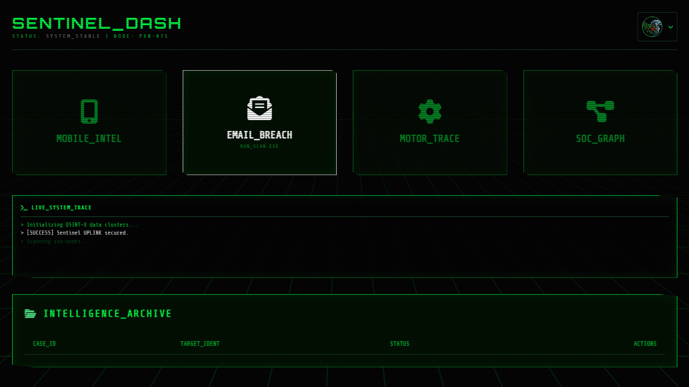

# 🛡️ OSINT-X | Intelligence Mainframe

**OSINT-X** is an advanced open-source intelligence dashboard designed to monitor and analyze digital footprints. Built for the modern cybersecurity landscape, it specializes in real-time data breach detection and threat intelligence.

🔗 **[LIVE DEMO](https://Codewith-Pranavag.github.io/OSINT-X/)

---

## ⚡ Key Features
* **Breach Shield:** Real-time email breach analysis using the XposedOrNot API.
* **Intelligence Archive:** Automated logging of all target scans with unique Case IDs.
* **Visual HUD:** A high-tech CRT/Neon-Green interface designed for security analysts.
* **Instant Reporting:** Generate and download detailed security reports in JSON format.
* **Live System Trace:** A terminal-style activity log that monitors system health and uplink status.

## 🛠️ Tech Stack
* **Frontend:** HTML5, Tailwind CSS, JavaScript (ES6+)
* **Styling:** Custom CRT Scanline effects & Orbitron Typography
* **Icons:** FontAwesome v6.0
* **API:** XposedOrNot (Data Breach Clearinghouse)

## 📸 Dashboard Preview
 


---

## 🚀 How to Run Locally
1. Clone the repository:
   ```bash
   git clone [https://github.com/Codewith-Pranavag/OSINT-X.git](https://github.com/Codewith-Pranavag/OSINT-X.git)
